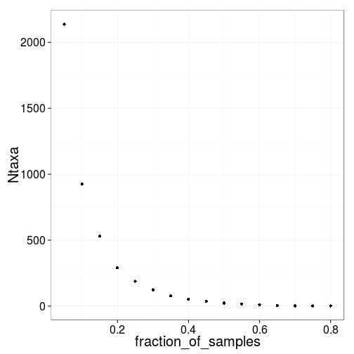
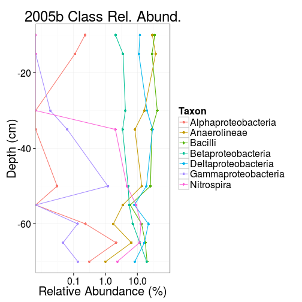
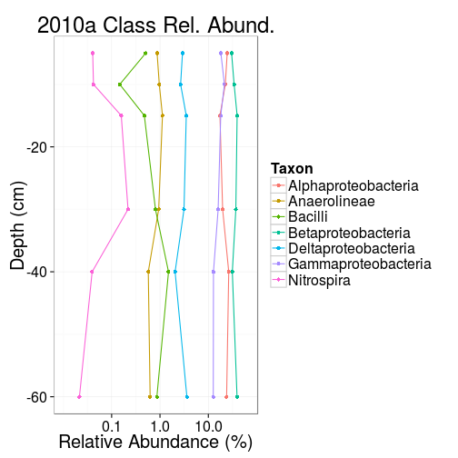
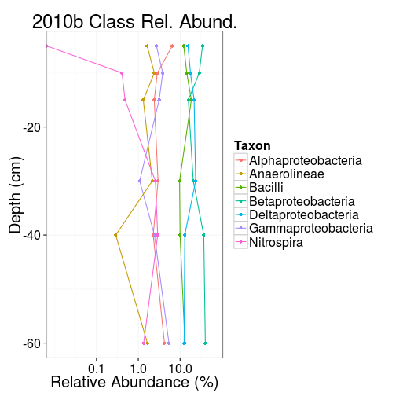
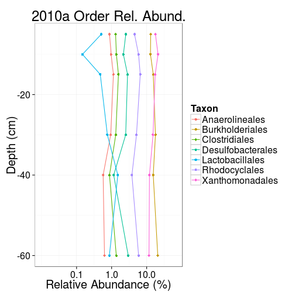

Load package and import data.


```r
library("phyloseq"); packageVersion("phyloseq")
```

```
## [1] '1.10.0'
```

```r
library("plyr"); packageVersion("plyr")
```

```
## [1] '1.8.1'
```

```r
siavash <- import_biom("otu_table.biom")
sum(taxa_sums(siavash) < 2)
```

```
## [1] 12629
```

```r
# Replace default rank names
#rank_names(siavash)
colnames(tax_table(siavash)) <- c("Kingdom", "Phylum", "Class", "Order", "Family", "Genus", "Species", "Specimen")

# Mark NAs as Unknowns
tax_table(siavash)[is.na(tax_table(siavash))] <- "Unknown"
#nams <- as.character(PhylumMean$Phylum)
#nams[is.na(nams)] <- "Unknown"
#PhylumMean$Phylum <- factor(nams)

# Read and merge mapping file
#map = import_qiime_sample_data("mapping_file_cat_coreA_degen.coreB_nondegen.coreB_corrected_taxa_summary.txt")
map <- import_qiime_sample_data("mapping_siavashabb2.txt")
siavash <- merge_phyloseq(siavash, map)

# Read phylotree
tree <- read_tree('rep_set1.tre')

# Merge the tree to Siavash data
siavash <- merge_phyloseq(siavash, tree)

# Process sample names
namevars <- strsplit(sample_names(siavash), ".", fixed = TRUE)
names(namevars) <- sample_names(siavash)
namevars <- ldply(namevars)
colnames(namevars) <- c("Sample", "Year", "Depthcm", "Batch")
rownames(namevars) <- namevars$Sample

# Add new table to old
siavash <- merge_phyloseq(siavash, sample_data(namevars))

# Convert "Depthcm" to integers
sample_data(siavash)$Depthcm <- gsub("cm", "",
                                     sample_data(siavash)$Depthcm)
sample_data(siavash)$Depthcm <- as.integer(sample_data(siavash)$Depthcm)

# Remove the two samples that don't have a real depth
siavash <- subset_samples(siavash, !is.na(Depthcm))

# Fix minor duplicates in Batch label
sample_data(siavash)$Batch <- gsub("2", "",
                                   sample_data(siavash)$Batch)
```


After reading in the BIOM data we have 2.6941 &times; 10<sup>5</sup> reads in the OTU table from 40 samples, with reads per sample ranging from 967 to 2.0335 &times; 10<sup>4</sup>, with an average of 6735.25 reads per sample and a median of 6068 reads per sample. 


Remove sample-wise singletons using kOverA filtering.


```r
k <- 3L
A <- 1L
flist <- genefilter::filterfun(genefilter::kOverA(k, A, na.rm=TRUE))
siavash1 <- filter_taxa(siavash, flist, prune=TRUE)
```

Using a `kOverA` threshold criteria with 
minimum count of 3 reads
in at least 1 samples
results in a reduction of 19764 OTUs from the original 21067 OTUs leaving us with 1303 OTUs.

After this filtering we have 2.02921 &times; 10<sup>5</sup> reads in the OTU table from 40 samples, with reads per sample ranging from 686 to 1.5532 &times; 10<sup>4</sup>, with an average of 5073.025 reads per sample and a median of 4753 reads per sample. 


The most abundant phyla after this filtering:


```r
physum <- tapply(taxa_sums(siavash1),
                tax_table(siavash1)[, "Phylum"],
                sum)
keepPhy <- names(sort(physum, TRUE))[1:8]
keepPhy
```

```
## [1] "__Proteobacteria" "__Firmicutes"     "__Chloroflexi"   
## [4] "Unknown"          "__Bacteroidetes"  "__Nitrospirae"   
## [7] "__Actinobacteria" "__Planctomycetes"
```

## Alpha diversity estimators


```r
library("ggplot2"); packageVersion("ggplot2")
```

```
## Need help? Try the ggplot2 mailing list: http://groups.google.com/group/ggplot2.
```

```
## [1] '1.0.0'
```

```r
theseMeas <- c("Shannon", "Chao1")
p <- plot_richness(siavash1, measures = theseMeas)
# Add group
p$data$Group <- factor(apply(p$data[, c("Year","Batch")], 1, function (x) {paste(x, collapse = "")}))

# Define a custom ggplot
richaes <- aes(-Depthcm, value, color=factor(Year), shape=Batch, group = Group)
ptlayer <- geom_point(size=5, position = position_jitter(w = 0.05, h = 0)) 
ptlayer2 <- geom_line(aes(group = Group))
p <- ggplot(p$data, richaes) + ptlayer
#print(p + facet_wrap(~variable, ncol = 1, scales = "free_y"))

# Shannon
Shandat <- subset(p$data, variable == "Shannon")
pShan <- ggplot(Shandat, richaes) + ptlayer + ptlayer2 
pShan <- update_labels(pShan, list(y="Shannon Index"))
theme_set(theme_bw(20))
pShan <- pShan + coord_flip()
pShan <- pShan + xlab("Depth (cm)") 
print(pShan)
```

 

```r
# Chao1
Chaodat <- subset(p$data, variable == "Chao1")
pChao <- ggplot(Chaodat, richaes) + ptlayer + ptlayer2
pChao <- update_labels(pChao, list(y="Chao1 Index"))
theme_set(theme_bw(20))
pChao <- pChao + coord_flip()
pChao <- pChao + xlab("Depth (cm)") 
print(pChao)
```

 


Significance p-values for diversity comparisons based on t-test (Wilcoxon test would be problematic since we have so few data points per group). P-values are corrected for multiple testing with Benjamini-Yekutieli correction (Benjamini, Y., and Yekutieli, D. (2001). The control of the false discovery rate in multiple testing under dependency. Annals of Statistics 29, 1165–1188). I also marked TRUE/FALSE for significance at the standard \(p<0.05\) level based on the corrected p-values.


```r
pvalues.ab <- NULL
for (divind in theseMeas) {
  print(divind)
  pairs <- list()
  for (year in unique(p$data$Year)) {
    a <- subset(p$data, variable == divind & Year == year & Batch == "a")$value
    b <- subset(p$data, variable == divind & Year == year & Batch == "b")$value
    pairs[[paste(year, "a", sep = "-")]] <- a
    pairs[[paste(year, "b", sep = "-")]] <- b
  }


  # All unique comparisons
  pvalues <- NULL
  combos <- t(combn(names(pairs), 2))
  for (i in 1:nrow(combos)) {
    n1 <- combos[i, 1]
    n2 <- combos[i, 2]  
    pval <- t.test(pairs[[n1]], pairs[[n2]])$p.value
    pvalues <- rbind(pvalues, c(n1, n2, pval))
  }
  pvalues <- as.data.frame(pvalues)
  colnames(pvalues) <- c("Group1", "Group2", "pvalue")
  pvalues$pvalue <- p.adjust(as.numeric(as.character(pvalues$pvalue)), "BY")
  pvalues$significant <- pvalues$pvalue < 0.05
  print(pvalues)
}
```

```
## [1] "Shannon"
##    Group1 Group2       pvalue significant
## 1  2005-a 2005-b 1.000000e+00       FALSE
## 2  2005-a 2011-a 5.296347e-04        TRUE
## 3  2005-a 2011-b 2.536330e-01       FALSE
## 4  2005-a 2010-a 6.213435e-06        TRUE
## 5  2005-a 2010-b 5.296347e-04        TRUE
## 6  2005-b 2011-a 2.541025e-04        TRUE
## 7  2005-b 2011-b 5.359364e-01       FALSE
## 8  2005-b 2010-a 6.213435e-06        TRUE
## 9  2005-b 2010-b 5.935629e-04        TRUE
## 10 2011-a 2011-b 1.323288e-03        TRUE
## 11 2011-a 2010-a 9.647446e-06        TRUE
## 12 2011-a 2010-b 2.477056e-04        TRUE
## 13 2011-b 2010-a 2.392830e-02        TRUE
## 14 2011-b 2010-b 5.359364e-01       FALSE
## 15 2010-a 2010-b 5.935629e-04        TRUE
## [1] "Chao1"
##    Group1 Group2       pvalue significant
## 1  2005-a 2005-b 1.000000e+00       FALSE
## 2  2005-a 2011-a 1.433044e-03        TRUE
## 3  2005-a 2011-b 8.047950e-01       FALSE
## 4  2005-a 2010-a 2.716437e-08        TRUE
## 5  2005-a 2010-b 3.548647e-04        TRUE
## 6  2005-b 2011-a 2.343676e-04        TRUE
## 7  2005-b 2011-b 8.047950e-01       FALSE
## 8  2005-b 2010-a 5.779813e-09        TRUE
## 9  2005-b 2010-b 2.048607e-04        TRUE
## 10 2011-a 2011-b 4.805045e-02        TRUE
## 11 2011-a 2010-a 5.003696e-08        TRUE
## 12 2011-a 2010-b 1.838674e-05        TRUE
## 13 2011-b 2010-a 4.464301e-03        TRUE
## 14 2011-b 2010-b 4.571708e-01       FALSE
## 15 2010-a 2010-b 7.441052e-06        TRUE
```


## More filtering

Before comparing samples, let's filter the rarely-seen taxa. 


```r
A <- 1L
# Increasing fracSamples beyond 0.8 will fail; too much filtering
fracSamples <- seq(0.05, 0.80, 0.05) 
filterList <- lapply(fracSamples, function(x, physeq = siavash){
  #print(x)
  k = round(x*nsamples(physeq))
  flist = genefilter::filterfun(genefilter::kOverA(k, A, na.rm=TRUE))
  return(filter_taxa(physeq, flist, prune=TRUE))
})
df <- data.frame(fraction_of_samples = fracSamples,
           Ntaxa=sapply(filterList, ntaxa))
ggplot(df, aes(fraction_of_samples, Ntaxa)) + geom_point()
```

 


## Ordination

For no particular reason, I'm going to keep OTUs that are observed at least once in 20% of the samples when doing sample-wise comparison.


```r
k <- round(0.2*nsamples(siavash))
A <- 1L
flist <- genefilter::filterfun(genefilter::kOverA(k, A, na.rm=TRUE))
siavash2 <- filter_taxa(siavash, flist, prune=TRUE)
```

Tree is now added, so I switched distance measure to Weighted Unifrac.


```r
siavash2p <- transform_sample_counts(siavash2, function(x) x/sum(x))
mds <- ordinate(siavash2p, "MDS", "wunifrac") # was: bray
#plot_scree(mds)
#p <- plot_ordination(siavash2p, mds, color = "Depthcm", shape="Batch")
#p + facet_wrap(~ Year, nrow = 1)

# OTUs
pOTU <- plot_ordination(siavash2p, mds, type = "taxa", color = "Phylum")
#print(pOTU)

# Add position average for each phylum
PhylumMean <- ddply(pOTU$data, "Phylum", function(df){
  data.frame(Axis.1 = mean(df$Axis.1),
             Axis.2 = mean(df$Axis.2),
             Phylum = df$Phylum[1])
})

# Plot 
pOTU + geom_text(data = PhylumMean, aes(label=Phylum), size=3)
```

 


## What is different from year to year?

Most abundant phyla in the overall filtered data - this is bit different than if you look at the counts directly from BIOM file (see above)!!


```r
physum <- rev(sort(tapply(taxa_sums(siavash2p),
              tax_table(siavash2p)[, "Phylum"], sum)))
physum
```

```
##         __Proteobacteria             __Firmicutes            __Chloroflexi 
##              23.42435282               5.77626704               4.06460584 
##          __Bacteroidetes            __Nitrospirae                  Unknown 
##               2.41157710               1.80737461               1.73366075 
##           __Fusobacteria         __Actinobacteria         __Planctomycetes 
##               0.22890344               0.18386814               0.16148260 
##               __Chlorobi __Candidate_division_OP9          __Synergistetes 
##               0.10290412               0.07005102               0.01981134 
##                   __TA06 
##               0.01514118
```

```r
df <- data.frame(list(Taxon = names(physum), RelAbundance = physum))
df$Taxon <- factor(df$Taxon, levels = rev(df$Taxon))
p <- ggplot(df, aes(x = Taxon, y = RelAbundance))
p <- p + geom_bar(stat = "identity")
p <- p + coord_flip()
p <- p + ylab("Relative Abundance (%)")
print(p)
```

 

```r
keepPhy <- names(sort(physum, TRUE))[1:8]
```


Summary of the data after all filtering:

```r
siavash2pf <- subset_taxa(siavash2p, Phylum %in% c(keepPhy))
siavash2pf
```

```
## phyloseq-class experiment-level object
## otu_table()   OTU Table:         [ 280 taxa and 40 samples ]
## sample_data() Sample Data:       [ 40 samples by 13 sample variables ]
## tax_table()   Taxonomy Table:    [ 280 taxa by 8 taxonomic ranks ]
## phy_tree()    Phylogenetic Tree: [ 280 tips and 279 internal nodes ]
```


Visualization on depth-abundance relations for the top-8 most abundant taxa at Phylum, Class, and Order levels (excluding the unclassified reads ie. 'Unknown'). Both total reads and relative abundance are shown for the initially filtered data (siavash1 ie. the data with those OTUs removed that do not have more than 3 reads in any sample - note that for PCA analysis we apply also the addditional filtering step based on 20% prevalence). Some figures are cut at low abundances but this concerns only zero abundances, so no need to worry. For the final paper we can always make nicer figures if needed. (Please double-check the results that they seem sensible overall, just to make sure the code is correct. If the results do not seem plausible then it is always possible the code has unnoticed bugs)


```r
# List total number of reads for each Taxonomic group at different year/batch/depth combinations
library(dplyr, quiet = TRUE)
```

```
## 
## Attaching package: 'dplyr'
## 
## The following objects are masked from 'package:plyr':
## 
##     arrange, count, desc, failwith, id, mutate, rename, summarise,
##     summarize
## 
## The following object is masked from 'package:stats':
## 
##     filter
## 
## The following objects are masked from 'package:base':
## 
##     intersect, setdiff, setequal, union
```

```r
source("funcs.R")
depthcounts <- list()
#rc <- readcounts(siavash1, "Phylum")
  
for (level in c("Phylum", "Class", "Order")) {
  
  # Take the year - batch - depth table for given taxonomic level
  rc <- readcounts(siavash1, level)
  
  # Use only the phyla that are most abundant on average
  physum <- rev(sort(tapply(taxa_sums(siavash2p),
                tax_table(siavash2p)[, level], sum)))
  keep <- setdiff(names(sort(physum, TRUE))[1:8], "Unknown")

  rcsub <- filter(rc, Taxon %in% keep)
  rcsub$Taxon <- gsub("__", "", rcsub$Taxon)
  depthcounts[[level]] <- rcsub 

  lims.abs <- range(log10(1 + depthcounts[[level]]$Reads))
  lims.rel <- range(depthcounts[[level]]$RelativeAbundance)
  lims.rel.log <- c(0.01, 100*max(depthcounts[[level]]$RelativeAbundance))

  for (year in sort(unique(depthcounts[[level]]$Year))) {
    for (batch in sort(unique(depthcounts[[level]]$Batch))) {
    
      df <- subset(depthcounts[[level]], Year == year & Batch == batch)
      p <- ggplot(df, aes(x = -Depth, y = 1 + Reads))
      p <- p + geom_point(aes(color = Taxon))
      p <- p + geom_line(aes(color = Taxon))
      p <- p + coord_flip()
      p <- p + ylim(log10(lims.abs))
      p <- p + scale_y_log10()
      p <- p + ggtitle(paste(year, batch, " ", level, " Tot. reads", sep = ""))
      p <- p + ylab("Total Read Count (N)")
      p <- p + xlab("Depth (cm)")
      print(p)
    
      #p2 <- ggplot(df, aes(x = -Depth, y = log10(RelativeAbundance)))
      p2 <- ggplot(df, aes(x = -Depth, y = 100*RelativeAbundance))
      p2 <- p2 + geom_point(aes(color = Taxon))
      p2 <- p2 + geom_line(aes(color = Taxon))
      p2 <- p2 + scale_y_log10(limits = lims.rel.log, breaks = c(0.1, 1, 10))
      #p2 <- p2 + ylim(lims.rel.log)
      p2 <- p2 + coord_flip()
      p2 <- p2 + ggtitle(paste(year, batch, " ", level, " Rel. Abund.", sep = ""))
      #p2 <- p2 + ylim(values = c(log10(min(setdiff(df$RelativeAbundance, 0))), log10(max(df$RelativeAbundance))))
      p2 <- p2 + ylab("Relative Abundance (%)")
      p2 <- p2 + xlab("Depth (cm)")
      print(p2)

    }
  }
}
```

```
## Scale for 'y' is already present. Adding another scale for 'y', which will replace the existing scale.
```

 

```
## Scale for 'y' is already present. Adding another scale for 'y', which will replace the existing scale.
```

  

```
## Scale for 'y' is already present. Adding another scale for 'y', which will replace the existing scale.
```

  

```
## Scale for 'y' is already present. Adding another scale for 'y', which will replace the existing scale.
```

  

```
## Scale for 'y' is already present. Adding another scale for 'y', which will replace the existing scale.
```

  

```
## Scale for 'y' is already present. Adding another scale for 'y', which will replace the existing scale.
```

  

```
## Scale for 'y' is already present. Adding another scale for 'y', which will replace the existing scale.
```

  

```
## Scale for 'y' is already present. Adding another scale for 'y', which will replace the existing scale.
```

  

```
## Scale for 'y' is already present. Adding another scale for 'y', which will replace the existing scale.
```

  

```
## Scale for 'y' is already present. Adding another scale for 'y', which will replace the existing scale.
```

  

```
## Scale for 'y' is already present. Adding another scale for 'y', which will replace the existing scale.
```

  

```
## Scale for 'y' is already present. Adding another scale for 'y', which will replace the existing scale.
```

  

```
## Scale for 'y' is already present. Adding another scale for 'y', which will replace the existing scale.
```

  

```
## Scale for 'y' is already present. Adding another scale for 'y', which will replace the existing scale.
```

  

```
## Scale for 'y' is already present. Adding another scale for 'y', which will replace the existing scale.
```

  

```
## Scale for 'y' is already present. Adding another scale for 'y', which will replace the existing scale.
```

  

```
## Scale for 'y' is already present. Adding another scale for 'y', which will replace the existing scale.
```

  

```
## Scale for 'y' is already present. Adding another scale for 'y', which will replace the existing scale.
```

   
