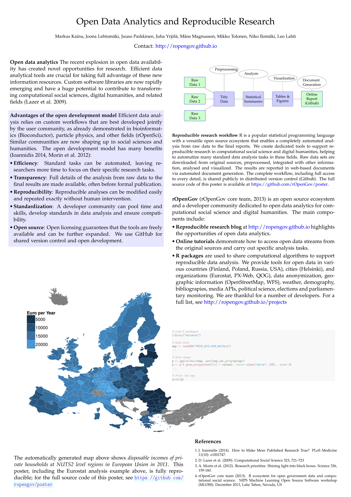

rOpenGov is all about reproducible research, so preparing a
**reproducible poster** became our mission after having the chance to
present at [International Conference on Computational Social Science
(ICCSS 2015)](http://iccss2015.eu/index.html) in Helsinki, June 8-11,
2015 (poster 36 in Monday session 15:30-17:00).

Our poster combines R code and automatically generated output with the
standard poster contents. The source code downloads data with the
[eurostat R package](http://github.com/rOpenGov/eurostat) and
generates the poster figures.

We ended up using plain tikz for designing the poster layout, although
nice ready-made poster layouts were available by
[baposter](http://www.brian-amberg.de/uni/poster/) and
[beamerposter](https://github.com/deselaers/latex-beamerposter) and
[tikzposter](http://www.ctan.org/pkg/tikzposter) and
[latextemplates.com](www.latextemplates.com/cat/conference-posters)
and [other
options](http://tex.stackexchange.com/questions/341/how-to-create-posters-using-latex). Whereas
the ready-made layouts are useful for fast poster design, they also
limit the available options as the graphical elements are laid out as
tightly defined text boxes. This is not suitable for all purposes, and
mixing ready-made styles with free design is potentially confusing. I
also bumped into some problems in incorporating R code with some of
these templates.

We achieved our goal by the
[LaTeX](http://www.latex-project.org/)/[tikz](http://sourceforge.net/projects/pgf/)
combination which allows reproducible design of arbitrary poster
layouts and schematic figures, as well as automated numbering of
figures and references. The
[R](http://www.r-project.org)/[Sweave](https://www.statistik.lmu.de/~leisch/Sweave/)
allows incorporation of R code and output (figures, tables, text). The
[a0poster
style](http://www.ctan.org/tex-archive/macros/latex/contrib/a0poster)
provided appropriate font sizes and other LaTeX utilities for
posters. If you are a frequent LaTeX user, we warmly recommend
familiarizing with [tikz](http://www.texample.net/tikz/). For further
details, see the [poster
sources](https://github.com/rOpenGov/poster/blob/master/2015-ICCSS/poster.Rnw).


To reproduce [the poster in A0
(PDF)](https://github.com/rOpenGov/poster/blob/master/2015-ICCSS/poster.pdf),
clone the [rOpenGov poster
repository](https://github.com/rOpenGov/poster) and run the following
commands in R:


```r
library(knitr)
knit2pdf("poster/2015-ICCSS/poster.Rnw")
```



