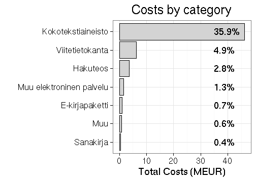
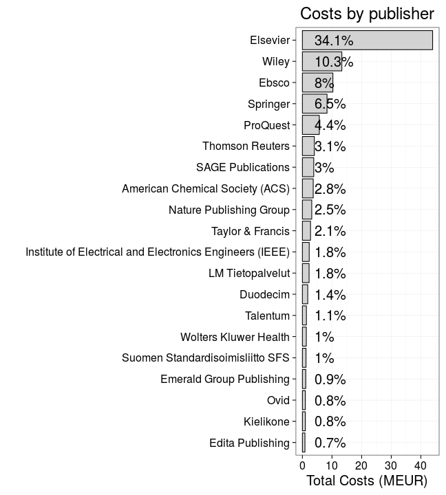
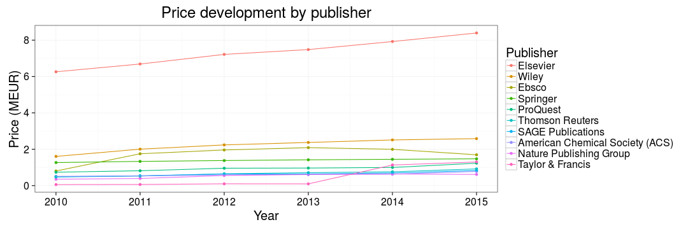

Publisher subscription costs in Finland 2010-2015
===========

### Background

Following [Tim Gowers FOI request on scientific subscription costs in
UK](http://gowers.wordpress.com/2014/04/24/elsevier-journals-some-facts/),
we made a similar request in Finland together with [OKF
Finland](http://fi.okfn.org/wg/openscience/) and [other open science
enthusiasts](https://www.facebook.com/groups/241398182642057/permalink/411482855633588).

I sent the FOI request to Finnish universities in summer 2014. After
their denial to release the data we appealed in court, which decided
the case positive for us in August 2015. The Finnish Ministry of
Education [Open Science Initiative](http://openscience.fi) then
collected and organized the data, which has now been released on
[their website](). The overall process is summarized in another [blog
post]().

Related data have been collected in a few countries (see Stuart
Lawson's [recent
post](http://stuartlawson.org/2016/06/publicly-available-data-on-international-journal-subscription-costs).
However, Finland is now one of the first countries (after US and UK)
where the subscription fees are available over several years at the
level of individual publishers. Below is a preliminary analysis of
this data collection, made with a fully reproducible [source
code](https://github.com/antagomir/temp/blob/master/20160610/foi.Rmd).

### Overall subscription costs 2010-2015

## Overall publication costs 2010-2015

 * Total costs for Finland 2010-2015: 128.9 million EUR
 * 62 organizations ([annual costs by organization](table/cost_by_organization_year.csv))
 * 244 publishers ([annual costs by publisher](table/cost_by_publisher_year.csv))
 * [Total costs by category](table/cost_by_category.csv)
 * [Total costs by agreement type](table/cost_by_type.csv)

## Cost development over time

Total costs paid to scientific publishers by Finland 2010-2015. The annual increase is indicated.

Top-10 publishers (out of 6) correspond to NaN% of the overall costs.

