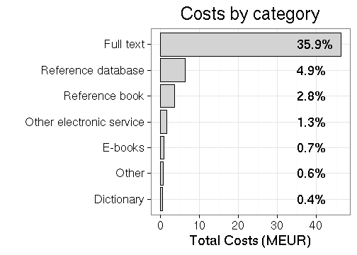

## Background

This is an extended version of the analysis posted in the [rOpenGov blog]().

Access to literature is fundamental to academic research but has been challenged with the rapidly increasing prices of academic journals, which university libraries find increasingly difficult to fund. Based on the [data from the US Association of Research Libraries](http://www.lib.washington.edu/scholpub/facts/economics), it can be estimated that the academic journal subscription charges increased four times faster than inflation in 1986-2007. Today, there are roughly 35 000 peer-reviewed academic journals ([Ware & Mabe, 2015](https://olh.openlibhums.org/articles/10.16995/olh.72/#B71)), and less than a third of these (11 000) are open access ([DOAJ, 2016](https://olh.openlibhums.org/articles/10.16995/olh.72/#B12)). The relative variation in prices is also considerable among the publishers. It was recently estimated, for instance, that Elsevier’s prices per citation are roughly 3x higher than with non-profit publishers; Emerald, Sage, and Taylor & Francis had roughly 10x higher prices ([Bergstrom et al. PNAS 2014](http://www.econ.ucsb.edu/~tedb/Journals/PNAS-2014-Bergstrom-1403006111.pdf)). The lack of pricing information and agreement details are likely to result in suboptimal contracts ([Cockerill, 2006](https://olh.openlibhums.org/articles/10.16995/olh.72/#B7); [Shieber, 2009](https://olh.openlibhums.org/articles/10.16995/olh.72/#B66)). Improved access to subscription costs can hance be expected to lead to better deals and lower costs for the universities.

Following [Tim Gowers successful FOI request on the subscription costs
for scientific journals in
UK](http://gowers.wordpress.com/2014/04/24/elsevier-journals-some-facts/),
we made a similar request in Finland together with the [Open Knowledge
Finland association and other Open Science
advocates](https://www.facebook.com/groups/241398182642057/permalink/411482855633588). After
the Finnish universities [turned down my FOI request in summer
2014](https://github.com/okffi-science/2014-tietopyynto-lisenssimaksut),
we appealed in court, which decided the case positive for us in August
2015. See a [separate blog post]() on this process.

The data on the subscription costs by the Finnish universities is now
released by the [Open Science Initiative](http://openscience.fi) of
the Finnish Ministry of Education. With this, Finland becomes to our
knowledge Finland the first country where the annual subscription fees
for all individual publishers and public research institutions have
been released, covering the years 2010-2015. In UK and US, the
information is available for some, but not all publishers due to the
complexities of gathering this information. Similar FOI request
process are ongoing but not yet completed in other countries,
including
[Switzerland](https://wisspub.net/2014/10/13/intransparenz-bei-den-bibliotheksausgaben-von-schweizer-hochschulen/)
and [New Zealand](http://publicaddress.net/9549); for a summary on
further countries, see Stuart Lawson's [recent
post](http://stuartlawson.org/2016/06/publicly-available-data-on-international-journal-subscription-costs).

The data seems to contain only the subscription fees, and not open access
article processing charges, as I could not find some major open access
players from the list. It was recently reported by [Naukkarinen
(2016)](https://avointiede.fi/documents/10864/12232/Avoimen+julkaisemisen+tuen+malli/73838e9b-7924-446c-9c7a-cc8f759919bb)
that in 2014 [18% of the articles in Finnish universities were
published as open
access](https://l.facebook.com/l.php?u=https%3A%2F%2Favointiede.fi%2Fdocuments%2F10864%2F12232%2FAvoimen%2Bjulkaisemisen%2Btuen%2Bmalli%2F73838e9b-7924-446c-9c7a-cc8f759919bb&h=-AQFlKomT). It
was also estimated that publishing all articles as Open Access would
have cost 17 MEUR, whereas the subscription fees in 2014 were 22
MEUR. This would support the transition to the Open Access model.

Here, I provide a brief preliminary analysis of the data with
[reproducible source
code](https://github.com/antagomir/temp/blob/master/20160610/foi.Rmd). I
have translated key terms from the Finnish data release to better
serve the international audience. Pull requests for additional
analyses are welcome and will be acknowledged appropriately.

## Overall subscription costs 2010-2015

Based on the data collected by the Ministry of Education, Finland paid in total
128.9 million EUR subscription and other
fees on scientific publishing in 2010-2015. The average annual costs for in Finland were 21 MEUR in 2010-2015; this is one third of the annual costs for journal subscriptions in Austria that have been estimated to be around 70 MEUR by the Austrian research funder Zentrale Einrichtung zur Förderung (FWF) ([Bauer et al., 2015](https://olh.openlibhums.org/articles/10.16995/olh.72/#B4)), and two thirds of the annual expenditure of 31 MEUR in [New Zealand](http://publicaddress.net/9549). Data for the top-10 publishers in the UK 2010-2014 is available in [Lawson, Meghreblian & Brook, 2015](https://olh.openlibhums.org/articles/10.16995/olh.72/#B45) ([Table 1](https://olh.openlibhums.org/articles/10.16995/olh.72)). During this period the UK paid altogether 4319 MEUR (rough estimate based on the exchange rate June 12, 2016) for the top-10 publishers, which is roughly half of the overall subscription expenditure in the UK based on the same article. The publisher-level information is available only for the top-10 publishers in the UK, whereas in Finland it is available for all 244 publishers. Finland paid 61 MEUR for the same top-10 publishers in the same period 2010-2014, which is  1.4% of the UK expenditure (sounds rather low?). 

Information for Finland is available by [agreement
type](table/cost_by_type.csv), organization type, and [subscription
category](table/cost_by_category.csv).

### Costs by publisher

Overall, the Finnish data covers 244 publishers ([see annual costs by publisher](table/cost_by_publisher_year.csv)). The left figure indicates the total subscription fees paid to the top publishers 2010-2015. Over one third of the total costs go to Elsevier, which has been often [criticized](https://gowers.wordpress.com/2014/04/24/elsevier-journals-some-facts/) for its huge [profit margins](http://journals.plos.org/plosone/article?id=10.1371%2Fjournal.pone.0127502). The costs are given per bundle, so we cannot compare average journal prices among individual publishers based on this data. A rough look at the number of subscriptions indicates that Elsevier has third most subscriptions (3.7%) but this is not very informative as the bundle sizes may vary greatly. 

The total costs paid to scientific publishers by Finland have increased roughly 10% per year in 2010-2015 (annual increase is indicated in the left figure). The top-10 publishers correspond to 77% of the overall costs (right figure). See a separate table for full [annual costs by publisher](table/cost_by_publisher_year.csv). 

### Costs by organization

The Finnish data collection includes 62 organizations ([see annual costs by organization](table/cost_by_organization_year.csv)). The universities ('yliopisto') are responsible of 80.4% of all costs (left figure); University of Helsinki had the highest total costs in 2010-2015 (24.4 MEUR; top institutions shown in the right figure).

As could be expected, the costs increase rather evenly across institutions. 

