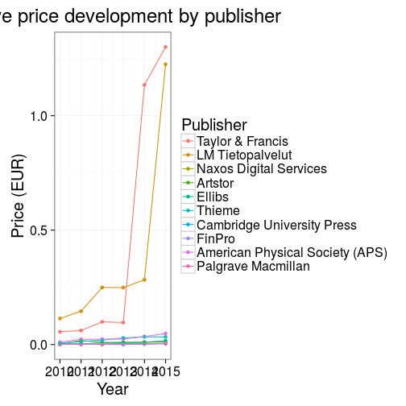

FOI request
===========


### Data overview


```
## Error: <text>:28:1: unexpected symbol
## 27:        ylab("Hinta (EUR)")
## 28: print
##     ^
```


### Relative increase in costs 2015 vs 2010


```r
dfs <- df %>% group_by(Vuosi, Kustantaja) %>% summarise(Hinta = sum(Hinta)) %>% arrange(Vuosi)
dfss <- spread(dfs, Vuosi, Hinta)
kasvu <- unlist(dfss[, "2015"]/dfss[, "2010"]);
names(kasvu) <- as.character(dfss$Kustantaja)
sort(kasvu)
```

```
##                                                                                                                East View 
##                                                                                                                0.1368801 
##                                                                                                         Maney Publishing 
##                                                                                                                0.1560187 
##                                                                                                        ASM International 
##                                                                                                                0.2266293 
##                                                                                                            Tilastokeskus 
##                                                                                                                0.3237245 
##                                                                                             Metsäntutkimuslaitos (Metla) 
##                                                                                                                0.4416357 
##                                                                                                                  Kompass 
##                                                                                                                0.4767580 
##                                                                                                              eMusicQuest 
##                                                                                                                0.5013550 
##                                                                                                          Aalto-yliopisto 
##                                                                                                                0.5470316 
##                                                                                                    Know China Technology 
##                                                                                                                0.5700837 
##                                                                                                                     ETLA 
##                                                                                                                0.6817554 
##                                                                                               Institute of Physics (IOP) 
##                                                                                                                0.6828915 
##                                                                                                           WSOY /Talentum 
##                                                                                                                0.7235572 
##                                                                                                     OECD /Wize Nordic AB 
##                                                                                                                0.7694979 
##                                                                                                   Walter de Gruyter GMBH 
##                                                                                                                0.8061582 
##                                                                                                                Kielikone 
##                                                                                                                0.8384361 
##                                                                               Centre for Economic Policy Research (CEPR) 
##                                                                                                                0.8533372 
##                                                                                                           Wolters Kluwer 
##                                                                                                                0.8975285 
##                                                                                                                 Integrum 
##                                                                                                                0.9406627 
##                                                                                                 Esmerk / M-Brain Insight 
##                                                                                                                0.9942287 
##                                                                                                             SPARC Europe 
##                                                                                                                1.0000000 
##                                                                                                       Statistikcentralen 
##                                                                                                                1.0000000 
## Viite & Hakuteos & kokotekstietokannat:  tilattu useilta kotimaiselta ja kansainväliseltä kustantajalta tai välittäjältä 
##                                                                                                                1.0028400 
##                                                                                                   Suomen asiakastieto Oy 
##                                                                                                                1.0043942 
##                                                                                                      BTJ Kirjastopalvelu 
##                                                                                                                1.0157893 
##                                                                                                         NewspaperDirect  
##                                                                                                                1.0237203 
##                                                                                                    Mid Sweden University 
##                                                                                                                1.0240202 
##                                                                                 Association for Computer Machinery (ACM) 
##                                                                                                                1.0343220 
##                                                                                                                     Warc 
##                                                                                                                1.0720000 
##                                                                                                                     Beck 
##                                                                                                                1.0815765 
##                                                            Niedersächsische Staats- und Universitätsbibliothek Göttingen 
##                                                                                                                1.0833333 
##                                                                                      Lippincott Williams & Wilkins (LWW) 
##                                                                                                                1.0943189 
##                                                                                                             Kirjavälitys 
##                                                                                                                1.0978648 
##                                                                                                             OECD /Turpin 
##                                                                                                                1.1151685 
##                                                                                                    Wolters Kluwer Health 
##                                                                                                                1.1167343 
##                                                                                  Encyclopedia Britannica /Wize Nordic AB 
##                                                                                                                1.1213804 
##                                                                                                      Helsingin yliopisto 
##                                                                                                                1.1278962 
##                                                                                                The Optical Society (OSA) 
##                                                                                                                1.1367031 
##                                                                                                                   Knovel 
##                                                                                                                1.1486026 
##                                                                                                                 Springer 
##                                                                                                                1.1621138 
##                                                                                                                  Lovdata 
##                                                                                                                1.1653846 
##                                                                                                         Edita Publishing 
##                                                                                                                1.1740221 
##                                                                                                        Helsingin Sanomat 
##                                                                                                                1.1825694 
##                                                                                                                  OTDBASE 
##                                                                                                                1.1825726 
##                                                                               American Society of Civil Engineers (ASCE) 
##                                                                                                                1.1826968 
##                                                                                                        Kansalliskirjasto 
##                                                                                                                1.2046897 
##                                                                                   Suomalaisen Kirjallisuuden Seura (SKS) 
##                                                                                                                1.2080794 
##                                                                                                  Encyclopedia Britannica 
##                                                                                                                1.2212547 
##                                                                                                                Benjamins 
##                                                                                                                1.2300208 
##                                                               American Association for the Advancement of Science (AAAS) 
##                                                                                                                1.2306234 
##                                                                    Communication Institute for Online Scholarship (CIOS) 
##                                                                                                                1.2342767 
##                                                                                                                     OECD 
##                                                                                                                1.2363101 
##                                                                                                              Wize Nordic 
##                                                                                                                1.2395220 
##                                                                          American Society Of Mechanical Engineers (ASME) 
##                                                                                                                1.2406393 
##                                                                                                                    Grove 
##                                                                                                                1.3052738 
##                                                                                      CSC - Tieteen tietotekniikan keskus 
##                                                                                                                1.3137554 
##                                                                                                         Cengage Learning 
##                                                                                                                1.3141787 
##                                                                      International Bureau of Fiscal Documentation (IBFD) 
##                                                                                                                1.3295455 
##                                                                                                                 Elsevier 
##                                                                                                                1.3408720 
##                                                                                                                  FinELib 
##                                                                                                                1.3723961 
##                                                                                         Chemical Abstracts Service (CAS) 
##                                                                                                                1.3729099 
##                                                                                                                    JSTOR 
##                                                                                                                1.3766798 
##                                                                                                             Project Muse 
##                                                                                                                1.4079346 
##                                                                                       Association of Asian Studies (AAS) 
##                                                                                                                1.4090431 
##                                                                                                     Nationalencyklopedin 
##                                                                                                                1.4335438 
##                                                                                              World Scientific Publishing 
##                                                                                                                1.4368482 
##                                                                                                          Bureau van Dijk 
##                                                                                                                1.4428769 
##                                                                              National Bureau of Economic Research (NBER) 
##                                                                                                                1.4717340 
##                                                                               Johns Hopkins University Press (JHU Press) 
##                                                                                                                1.4718068 
##                                                                                         Suomen Standardisoimisliitto SFS 
##                                                                                                                1.4728648 
##                                                                                              PSK Standardisointiyhdistys 
##                                                                                                                1.4966767 
##                                                                                                                 HighWire 
##                                                                                                                1.5092689 
##                                                                                                  Sanoma Media Finland Oy 
##                                                                                                                1.5178571 
##                                                                                          American Chemical Society (ACS) 
##                                                                                                                1.5293024 
##                                                                                                Euromonitor International 
##                                                                                                                1.5368182 
##                                                                                                 Emerald Group Publishing 
##                                                                                                                1.5601831 
##                                                                                                           Annual Reviews 
##                                                                                                                1.5699458 
##                                                                                 The National Bureau of Economic Research 
##                                                                                                                1.5740741 
##                                                                                         Materials Research Society (MRS) 
##                                                                                                                1.5741525 
##                                                                                            Oxford University Press (OUP) 
##                                                                                                                1.5798050 
##                                                                                                                    Wiley 
##                                                                                                                1.6073770 
##                                                                             American Council of Learned Societies (ACLS) 
##                                                                                                                1.6244672 
##                                                                                                              PressReader 
##                                                                                                                1.6249436 
##                                                                                      Lippincott Williams & Wilkins (LWW) 
##                                                                                                                1.6335550 
##                                                                                                                 ProQuest 
##                                                                                                                1.6685564 
##                                                                                                                     Ovid 
##                                                                                                                1.6887322 
##                                                                                                                CSH Press 
##                                                                                                                1.6914082 
##                                                                                                        SAGE Publications 
##                                                                                                                1.7131656 
##                                                                                                  Nature Publishing Group 
##                                                                                                                1.7426496 
##                                                                 Institute of Electrical and Electronics Engineers (IEEE) 
##                                                                                                                1.7966479 
##                                                                                                                     Gale 
##                                                                                                                1.8201324 
##                                                                                                                     IFSR 
##                                                                                                                1.8868841 
##                                                                                                                Retriever 
##                                                                                                                1.8883333 
##                                                                                                                  Brepols 
##                                                                                                                1.9035990 
##                                                              Centre for Agriculture and Biosciences International (CABI) 
##                                                                                                                1.9039548 
##                                                                                                          Thomson Reuters 
##                                                                                                                1.9349174 
##                                                                                                                    Ebsco 
##                                                                                                                2.1079880 
##                                                                                      American Dietetic Association (ADA) 
##                                                                                                                2.1577909 
##                                                                                                                BMJ Group 
##                                                                                                                2.2033848 
##                                                                                                                 Burgundy 
##                                                                                                                2.2330737 
##                                                                                                              Kauppalehti 
##                                                                                                                2.2510824 
##                                                                                      American Mathematical Society (AMS) 
##                                                                                                                2.3244384 
##                                                                                       LM Tietopalvelut /Wize Nordic 2014 
##                                                                                                                2.6945455 
##                                                                                         Royal Society of Chemistry (RSC) 
##                                                                                                                2.6945793 
##                                                                                                   Alexander Street Press 
##                                                                                                                2.7479573 
##                                                                                                              Riksarkivet 
##                                                                                                                2.8751942 
##                                                                                                            Rakennustieto 
##                                                                                                                3.0276513 
##                                                                                                                    Brill 
##                                                                                                                3.0512821 
##                                                                                                              Datamonitor 
##                                                                                                                3.1260454 
##                                                                                                                  Informa 
##                                                                                                                3.1929032 
##                                                                                                    McGraw-Hill Education 
##                                                                                                                3.2857850 
##                                                                                                                 Duodecim 
##                                                                                                                3.2874348 
##                                                                                                                 Talentum 
##                                                                                                                3.3455525 
##                                                                                                         Adato Energia Oy 
##                                                                                                                3.3826638 
##                                                                                                             Sahköinfo Oy 
##                                                                                                                3.7098175 
##                                                                                                       Palgrave Macmillan 
##                                                                                                                3.9337979 
##                                                                                          American Physical Society (APS) 
##                                                                                                                4.5422946 
##                                                                                                                   FinPro 
##                                                                                                                4.6086957 
##                                                                                               Cambridge University Press 
##                                                                                                                4.8414518 
##                                                                                                                   Thieme 
##                                                                                                                5.5190083 
##                                                                                                                   Ellibs 
##                                                                                                                5.9963100 
##                                                                                                                  Artstor 
##                                                                                                                6.0486909 
##                                                                                                   Naxos Digital Services 
##                                                                                                               10.5844444 
##                                                                                                         LM Tietopalvelut 
##                                                                                                               10.7323821 
##                                                                                                         Taylor & Francis 
##                                                                                                               23.3599188
```

```r
# Relative prices with 2010 baseline
# Top relative increase
kustantajat <- dfss[,1]
hinnat = as.matrix(dfss[, -1])
hinnat <- hinnat/hinnat[,1]
dfs2 <- as.data.frame(hinnat)
dfs2$Kustantaja <- as.character(unlist(kustantajat, use.names = F))
dfs2 <- dfs2[!is.na(dfs2[, "2015"]),]
dfs2 <- dfs2[rev(order(dfs2[, "2015"])),]
top <- as.character(unlist(dfs2$Kustantaja, use.names = F)[1:10])
dfs3 <- dfs[unlist(dfs$Kustantaja) %in% top,]
dfs3$Kustantaja <- as.character(unlist(dfs3$Kustantaja, use.names = F))
dfs3$Kustantaja <- factor(dfs3$Kustantaja, levels = top)
dfs3$Vuosi <- as.numeric(as.character(dfs3$Vuosi))
dfs3$Hinta <- as.numeric(as.character(dfs3$Hinta))
p <- ggplot(dfs3,
       aes(x = Vuosi, y = Hinta, color = Kustantaja)) +
       geom_point() +
       geom_line() +       
       ggtitle("Kokonaishintojen suhteellinen kehitys kustantajittain") +
       ylab("Hinta (EUR)") 
print(p)
```




