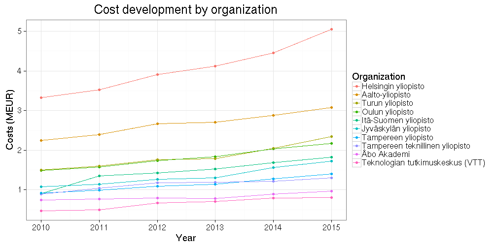

Scientific journal subscription costs in Finland 2010-2015
===========

## Background

Following [Tim Gowers successful FOI request on the subscription costs
for scientific journals in
UK](http://gowers.wordpress.com/2014/04/24/elsevier-journals-some-facts/),
we made a similar request in Finland together with the [Open Knowledge
Finland association and other Open Science
advocates](https://www.facebook.com/groups/241398182642057/permalink/411482855633588). After
the Finnish universities [turned down my FOI request in summer
2014](https://github.com/okffi-science/2014-tietopyynto-lisenssimaksut),
we appealed in court, which decided the case positive for us in August
2015.

The Finnish Ministry of Education [Open Science
Initiative](http://openscience.fi) then organized the [data release]()
as summarized [elsewhere](). With this, Finland is becoming one of the
first countries (after US and UK) where the subscription fees have
been released at the level of individual publishers. For a summary on
other countries, see Stuart Lawson's [recent
post](http://stuartlawson.org/2016/06/publicly-available-data-on-international-journal-subscription-costs).
Here, we present a preliminary analysis of the data, including
[reproducible source
code](https://github.com/antagomir/temp/blob/master/20160610/foi.Rmd). I
have here translated key terms from the Finnish data release to better
serve the international audience.

## Overall subscription costs 2010-2015

Based on the data collected by the Ministry of Education, Finland paid
128.9 million EUR subscription and other
fees on scientific publishing during 2010-2015. It seems to me that
open access publishing fees are not included, as I could not find some
major open access players (PLoS, BMC) from the list.

Information is also available on the [agreement
type](table/cost_by_type.csv), organization type, and [subscription
category](table/cost_by_category.csv).

### Costs by publisher

Overall, the Finnish data covers 244 publishers ([see annual costs by publisher](table/cost_by_publisher_year.csv)). The figure shows the absolute and relative fees paid to the top publishers during 2010-2015.

Interestingly, over one third of the total costs go to Elsevier, which is often [criticized](https://gowers.wordpress.com/2014/04/24/elsevier-journals-some-facts/) for its huge [profit margins](http://journals.plos.org/plosone/article?id=10.1371%2Fjournal.pone.0127502). Unfortunately the costs are given by bundle, so we cannot estimate prices per individual article between publishers from this data. A rough look at the number of subscriptions indicates that Elsevier has third most subscriptions (3.7%) but this is not very informative as the bundle sizes may vary greatly. 

The total costs paid to scientific publishers by Finland have increased roughly 10% per year in 2010-2015 (annual increase is indicated in the left figure). The top-10 publishers (out of 244) correspond to 77% of the overall costs (right figure). The full [annual costs by publisher](table/cost_by_publisher_year.csv) are in a separate table.

### Costs by organization

The Finnish data collection includes 62 organizations ([see annual costs by organization](table/cost_by_organization_year.csv)). The universities (yliopisto) carry 80.4% of all costs (left figure); University of Helsinki has the highest total costs 2010-2015 (24.4 MEUR; right figure).

As could be expected, the costs increase evenly across institutions. 

