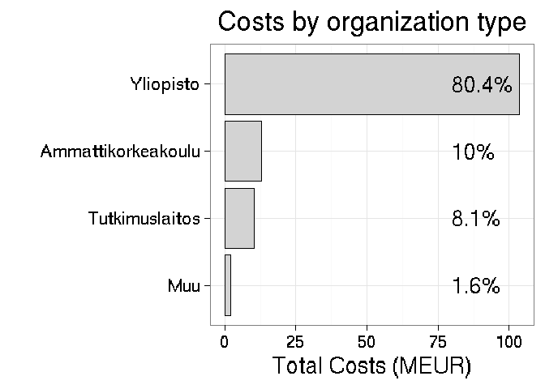
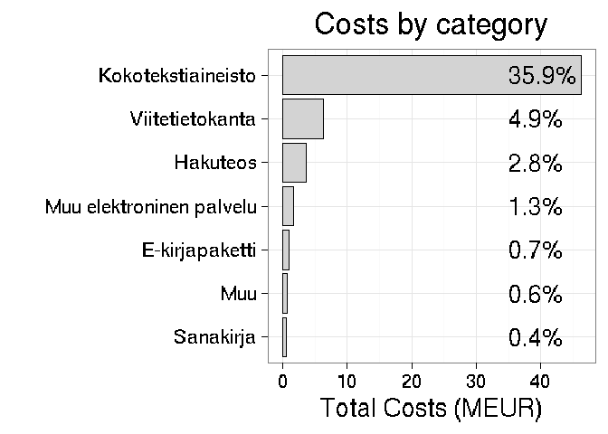

Subscription costs 2010-2015: the Finnish case
==============================================

### Background

Following [Tim Gowers successful FOI request on scientific subscription costs in UK](http://gowers.wordpress.com/2014/04/24/elsevier-journals-some-facts/), we realized by the [OKF Finland](http://fi.okfn.org/wg/openscience/) and [other open science enthusiasts](https://www.facebook.com/groups/241398182642057/permalink/411482855633588) that a similar FOI request could be made in Finland. I left the FOI request to Finnish universities in summer 2014. After their denial and esoteric explanations we appealed to court. The positive decision was given in August 2015. Then it took another year to collect and tidy up all the information across the Finnish universities and other institutions. The process is summarized in another [blog post](). The Finnish Ministry of Education [Open Science Initiative](http://openscience.fi) then collected and organized the data, which has now been released on [their website]().

Whereas related data have been collected in a few countries (see Stuart Lawson's [recent post](http://stuartlawson.org/2016/06/publicly-available-data-on-international-journal-subscription-costs), Finland is one of the very first countries (after US and UK) where the subscription costs are available for individual publishers over a several years time span. Here, I present preliminary analysis of this open data set. The fully reproducible source code of this document is [available](https://github.com/antagomir/temp/blob/master/20160610/foi.Rmd).

### Overall costs 2010-2015

### Total costs for Finland 2010-2015

The total costs paid to scientific publishers by Finland 2010-2015. The annual increase is indicated.

Publication costs with top publishers 2010-2015
-----------------------------------------------

-   [Total costs by organization (complete table)](table/cost_by_organization.csv)
-   [Total costs by publisher (complete table)](table/cost_by_publisher.csv)
-   [Total costs by material](table/cost_by_material.csv)
-   [Total costs by type](table/cost_by_type.csv)
-   [Total costs by year](table/cost_by_year.csv)

| Publisher                                                |  Cost (MEUR)|
|:---------------------------------------------------------|------------:|
| Elsevier                                                 |    43.971227|
| Wiley                                                    |    13.321876|
| Ebsco                                                    |    10.297640|
| Springer                                                 |     8.319385|
| ProQuest                                                 |     5.709784|
| Thomson Reuters                                          |     4.042072|
| SAGE Publications                                        |     3.836765|
| American Chemical Society (ACS)                          |     3.655505|
| Nature Publishing Group                                  |     3.159795|
| Taylor & Francis                                         |     2.747357|
| Institute of Electrical and Electronics Engineers (IEEE) |     2.305962|
| LM Tietopalvelut                                         |     2.266371|
| Duodecim                                                 |     1.816408|
| Talentum                                                 |     1.360409|
| Wolters Kluwer Health                                    |     1.327242|
| Suomen Standardisoimisliitto SFS                         |     1.229727|
| Emerald Group Publishing                                 |     1.147285|
| Ovid                                                     |     1.000727|
| Kielikone                                                |     0.998432|
| Edita Publishing                                         |     0.863660|

Costs by publisher over time
----------------------------

Top-10 publishers (out of 244) correspond to 77% of the overall costs.

