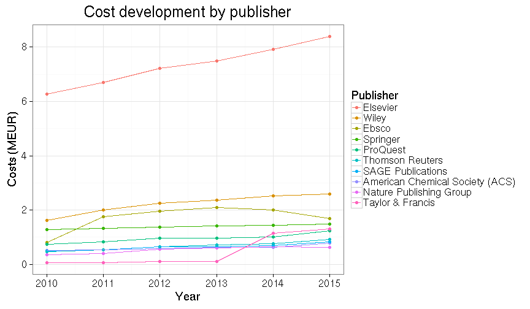

Publisher subscription costs in Finland 2010-2015
===========

## Background

Following [Tim Gowers successful FOI request on the subscription costs
for scientific journals in
UK](http://gowers.wordpress.com/2014/04/24/elsevier-journals-some-facts/),
we made a similar request in Finland together with the [Open Knowledge
Finland association and other Open Science
advocates](https://www.facebook.com/groups/241398182642057/permalink/411482855633588).

After the Finnish universities turned down my FOI request in summer
2014, we appealed in court, which decided the case positive for us in
August 2015. The Finnish Ministry of Education [Open Science
Initiative](http://openscience.fi) then organized the [data release]()
as summarized [elsewhere]().

Related data have been collected in a few countries, as summarized in
Stuart Lawson's [recent
post](http://stuartlawson.org/2016/06/publicly-available-data-on-international-journal-subscription-costs).
However, Finland is now one of the first countries (after US and UK)
where the subscription fees are available at the level of individual
publishers.

Below we present a preliminary analysis of this data collection based
on automated document generation with rmarkdown (see [source
code](https://github.com/antagomir/temp/blob/master/20160610/foi.Rmd)).

## Overall subscription costs 2010-2015

 * Total costs for Finland 2010-2015: 128.9 million EUR
 * [Total costs by subscription category](table/cost_by_category.csv)
 * [Total costs by agreement type](table/cost_by_type.csv)

### Costs by publisher

 * 244 publishers ([table of annual costs by publisher](table/cost_by_publisher_year.csv))

Total costs paid to scientific publishers by Finland 2010-2015. The annual increase is indicated.

Top-10 publishers (out of 244) correspond to 77% of the overall costs.

### Costs by organization

 * 62 organizations ([table of annual costs by organization](table/cost_by_organization_year.csv))

