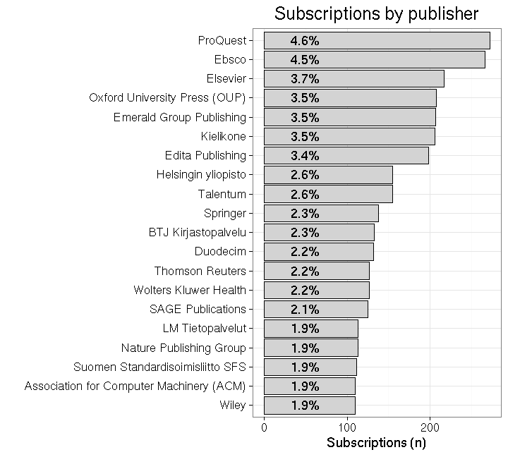
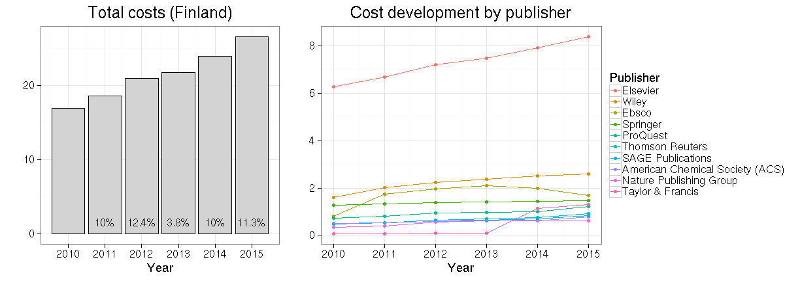

Scientific journal subscription costs in Finland 2010-2015
===========


## Background

Access to literature is fundamental to research. This has been challenged world-wide with the rapidly increasing prices of academic journals, which university libraries find increasingly difficult to fund. It has been estimated ([Ware & Mabe, 2015](https://olh.openlibhums.org/articles/10.16995/olh.72/#B71)) that the overall value of this market is around 10 billion US dollars. Based on the [data from the US Association of Research Libraries](http://www.lib.washington.edu/scholpub/facts/economics), it can be estimated that the academic journal subscription charges increased four times faster than inflation, in 1986-2007 (by 340%). Today, there are roughly 35 000 peer-reviewed academic journals ([Ware & Mabe, 2015](https://olh.openlibhums.org/articles/10.16995/olh.72/#B71)), and less than a third of these (11 000) are open access ([DOAJ, 2016](https://olh.openlibhums.org/articles/10.16995/olh.72/#B12)). This is likely to be a dysfunctional market due to missing information on subscription pricing and agreement details ([Cockerill, 2006](https://olh.openlibhums.org/articles/10.16995/olh.72/#B7); [Shieber, 2009](https://olh.openlibhums.org/articles/10.16995/olh.72/#B66)). The relative variation in prices is also considerable among the publishers. It was recently estimated, for instance, that Elsevier’s prices per citation are roughly 3x higher than with non-profit publishers; Emerald, Sage, and Taylor & Francis had roughly 10x higher prices ([Bergstrom et al. PNAS 2014](http://www.econ.ucsb.edu/~tedb/Journals/PNAS-2014-Bergstrom-1403006111.pdf)). Improved access to subscription costs can be expected to lead to better deals and lower costs for the universities.

Following [Tim Gowers successful FOI request on the subscription costs
for scientific journals in
UK](http://gowers.wordpress.com/2014/04/24/elsevier-journals-some-facts/),
we made a similar request in Finland together with the [Open Knowledge
Finland association and other Open Science
advocates](https://www.facebook.com/groups/241398182642057/permalink/411482855633588). After
the Finnish universities [turned down my FOI request in summer
2014](https://github.com/okffi-science/2014-tietopyynto-lisenssimaksut),
we appealed in court, which decided the case positive for us in August
2015.

The Finnish Ministry of Education [Open Science
Initiative](http://openscience.fi) then organized the [data release]()
as summarized [elsewhere](). With this, Finland is becoming one of the
first countries (after US and UK) where the subscription fees have
been released at the level of individual publishers. Similar FOI
request process are ongoing in other countries, including
[Switzerland](https://wisspub.net/2014/10/13/intransparenz-bei-den-bibliotheksausgaben-von-schweizer-hochschulen/)
and [New Zealand](http://publicaddress.net/9549); for a summary on
other countries, see Stuart Lawson's [recent
post](http://stuartlawson.org/2016/06/publicly-available-data-on-international-journal-subscription-costs).

Here, we provide a preliminary analysis of the data, including
[reproducible source
code](https://github.com/antagomir/temp/blob/master/20160610/foi.Rmd). I
have here translated key terms from the Finnish data release to better
serve the international audience.


## Overall subscription costs 2010-2015


```
## Warning in rbind_all(x, .id): Unequal factor levels: coercing to character
```

Based on the data collected by the Ministry of Education, Finland paid
128.9 million EUR subscription and other
fees on scientific publishing during 2010-2015.

It seems to me that the data contains only the subscription fees, and
not open access publishing fees, as I could not find some major open
access players from the list. It was recently reported by [Naukkarinen (2016)](https://avointiede.fi/documents/10864/12232/Avoimen+julkaisemisen+tuen+malli/73838e9b-7924-446c-9c7a-cc8f759919bb) that in 2014 [18% of the articles in Finnish universities were published as open access](https://l.facebook.com/l.php?u=https%3A%2F%2Favointiede.fi%2Fdocuments%2F10864%2F12232%2FAvoimen%2Bjulkaisemisen%2Btuen%2Bmalli%2F73838e9b-7924-446c-9c7a-cc8f759919bb&h=-AQFlKomT). Importantly, it was also estimated that publishing all articles as Open Access would have cost 17 MEUR, where as the subscription fees were 22 MEUR. This observation would support the transition to the Open Access model

It is interesting to compare the costs to other countries. The average annual costs for in Finland were 21 MEUR in 2010-2015; this is one third of the annual costs for journal subscriptions in Austria that have been estimated to be around 65–70 MEUR by the Austrian research funder Zentrale Einrichtung zur Förderung (FWF) ([Bauer et al., 2015](https://olh.openlibhums.org/articles/10.16995/olh.72/#B4)), and two thirds of the annual expenditure of 31 MEUR in [New Zealand](http://publicaddress.net/9549). Data for the top-10 publishers in the UK 2010-2014 is available in [Lawson, Meghreblian & Brook, 2015](https://olh.openlibhums.org/articles/10.16995/olh.72/#B45) ([Table 1](https://olh.openlibhums.org/articles/10.16995/olh.72)) and [Lawson & Meghreblian, F1000 Research 2015](http://f1000research.com/articles/3-274/v3). During this period the UK paid altogether 4319.4866653 MEUR (rough estimate based on the exchange rate June 12, 2016) for the top-10 publishers, which is roughly half of the overall expenditure in the UK. The publisher-level information is available only for the top-10 publishers in the UK, whereas in Finland it is available for all 244publishers. Finland paid 60.857873 MEUR for the same top-10 publishers in the same period 2010-2014, which is  1.4% of the UK expenditure. In Switzerland, a similar FOI process is ongoing, and some initial figures have been shared by [Christian Gutknecht](https://wisspub.net/2014/10/13/intransparenz-bei-den-bibliotheksausgaben-von-schweizer-hochschulen/). 

Information for Finland is also available on the [agreement
type](table/cost_by_type.csv), organization type, and [subscription
category](table/cost_by_category.csv).


### Costs by publisher

Overall, the Finnish data covers 244 publishers ([see annual costs by publisher](table/cost_by_publisher_year.csv)). The figure shows the absolute and relative fees paid to the top publishers during 2010-2015.

Interestingly, over one third of the total costs go to Elsevier, which is often [criticized](https://gowers.wordpress.com/2014/04/24/elsevier-journals-some-facts/) for its huge [profit margins](http://journals.plos.org/plosone/article?id=10.1371%2Fjournal.pone.0127502). Unfortunately the costs are given by bundle, so we cannot estimate prices per individual article between publishers from this data. A rough look at the number of subscriptions indicates that Elsevier has third most subscriptions (3.7%) but this is not very informative as the bundle sizes may vary greatly. 




The total costs paid to scientific publishers by Finland have increased roughly 10% per year in 2010-2015 (annual increase is indicated in the left figure). The top-10 publishers (out of 244) correspond to 77% of the overall costs (right figure). The full [annual costs by publisher](table/cost_by_publisher_year.csv) are in a separate table.




### Costs by organization


The Finnish data collection includes 62 organizations ([see annual costs by organization](table/cost_by_organization_year.csv)). The universities ('yliopisto') carry 80.4% of all costs (left figure); University of Helsinki has the highest total costs 2010-2015 (24.4 MEUR; top institutions shown in the right figure).


As could be expected, the costs increase evenly across institutions. 


